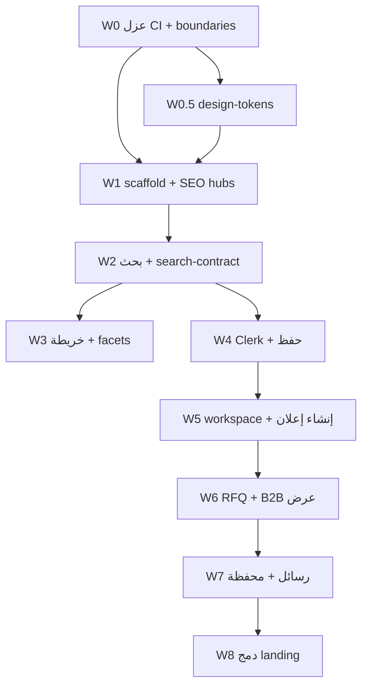

# دليل ما قبل البدء — موقع BANCO التكميلي

**الغرض:** ترتيب كل الأفكار، التحقق من الشروط، ومنع البدء قبل اكتمال المتطلبات.  
**التاريخ:** 2026-07-09  
**الحالة:** 📋 W0–W3 code جاهز · staging CDN معلّق · **الموبايل أولاً** — [`WEBSITE-EXECUTION-PRIORITY-AR.md`](./WEBSITE-EXECUTION-PRIORITY-AR.md)

---

## فهرس الوثائق (اقرأ بهذا الترتيب)

| # | الوثيقة | متى |
|---|---------|-----|
| 1 | **هذا الملف** | قبل أي قرار تنفيذ |
| 2 | [`WEBSITE-MASTER-PLAN-AR.md`](./WEBSITE-MASTER-PLAN-AR.md) | الرؤية + موجات W0–W8 |
| 3 | [`WEBSITE-FEATURE-MATRIX.md`](./WEBSITE-FEATURE-MATRIX.md) | تغطية ميزة × سطح × موجة |
| 4 | [`WEBSITE-READINESS-GATES.md`](./WEBSITE-READINESS-GATES.md) | قوائم تحقق قابلة للتوقيع |
| 4b | [`WEBSITE-EXECUTION-PRIORITY-AR.md`](./WEBSITE-EXECUTION-PRIORITY-AR.md) | **ترتيب التنفيذ: موبايل أولاً** |
| 5 | [`WEBSITE-SEPARATION-AND-COMPATIBILITY-PLAN.md`](./WEBSITE-SEPARATION-AND-COMPATIBILITY-PLAN.md) | تفاصيل معمارية إنجليزي |
| 6 | [`WEBSITE-MOBILE-INDEPENDENCE-CHECKLIST.md`](./WEBSITE-MOBILE-INDEPENDENCE-CHECKLIST.md) | كل PR ويب |

**تشغيل ونشر (خارج مجلد website):**

| موضوع | مسار |
|--------|------|
| Replit + GCP + AWS | `release/REPLIT_GOOGLE_AWS_UNIFIED_RUNBOOK.md` |
| GCP متطلبات Google | `deploy/gcp/reports/01-GCP_HOSTING_REQUIREMENTS.md` |
| GCP Go/No-Go | `deploy/gcp/reports/06-READINESS_CHECKLIST_GONOGO.md` |
| nginx مسارات الويب | `deploy/aws/nginx.conf` |
| حالة الريبوهين | `DUAL_REPO_STATUS.md` |

---

## 1. ملخص تنفيذي (صفحة واحدة)

> **ترتيب التنفيذ:** Replit FRESH → wave-b → EAS. الويب W3 staging بالتوازي ومعزول — [`WEBSITE-EXECUTION-PRIORITY-AR.md`](./WEBSITE-EXECUTION-PRIORITY-AR.md)

**المطلوب:** موقع ويب تكميلي **شامل** يخدم المشروع دون المساس بالموبايل:

- **مستهلك:** تصفح، بحث، SEO، مشاركة
- **بائع:** إنشاء إعلانات، متابعة شغله، leads، مقاييس (W5)
- **تاجر B2B:** عبر **dealer-os** `/market/` — ربط لا دمج
- **إدارة:** **admin-os** `/admin/` — داخلي فقط
- **تشغيل:** CI/CD وCDN منفصلان؛ API مستقل

**التقنية المعتمدة:** `artifacts/banco-web` (Next.js App Router) + `artifacts/landing` (hub) + مكتبات مشتركة (`taxonomy`, `api-client-react`, `search-contract`).

**الكفاءة:** contract-first، إعادة استخدام hooks المولّدة، موجات صغيرة مع rollback، عزل CI من اليوم الأول.

---

## 2. قرارات مقفلة (لا إعادة نقاش إلا بطلب صريح)

| ID | القرار | القيمة |
|----|--------|--------|
| D1 | Stack الموقع الشامل | Next.js 15+ App Router في `artifacts/banco-web` |
| D2 | عزل الموبايل | لا import من `banco-mobile`؛ فشل ويب لا يحجب EAS |
| D3 | إنشاء إعلان على الويب | **نعم** — موجة W5 `/workspace` |
| D4 | B2B مكتب كامل | **dealer-os** منفصل على `/market/` |
| D5 | Admin | **admin-os** على `/admin/` — لا UI في banco-web |
| D6 | عقد API | OpenAPI أولاً → codegen → ثم UI |
| D7 | SEO قائم | الإبقاء على `api-server` `/l/:id` حتى W8 |
| D8 | نفس monorepo | `BANCO-CA-OOM` — لا ريبو منفصل للويب |
| D9 | نطاق Git | ريبوهان فقط: `-BANCO-CA-OOM-` + `aws-virgen` |
| D10 | لغة الواجهة | عربي RTL أساسي + EN حيث موجود في المنتج |

---

## 3. بوابات Go — يجب إغلاقها قبل W0

### 3.1 بوابة المنتج والاتفاق

| # | شرط | الحالة | إجراء |
|---|------|--------|--------|
| G-P1 | موافقة صريحة على D1–D10 | ⏳ | المالك: «موافق — ابدأ W0» |
| G-P2 | أولوية الموجات (W1 hubs → W2 بحث → W5 workspace) | ⏳ | تأكيد أو تعديل |
| G-P3 | landing: hub حالي vs minimal | ⏳ | التوصية: hub حتى W8 |

### 3.2 بوابة الكود والـ CI (الأساس)

| # | شرط | التحقق | الحالة |
|---|------|--------|--------|
| G-C1 | `main` على origin محدث | `git fetch && rev-parse origin/main` | راجع `DUAL_REPO_STATUS.md` |
| G-C2 | CI Run ناجح 5/5 على كود مُختبَر | GitHub Actions | ⚠️ تحقق من الفوترة إن أحمر |
| G-C3 | `pnpm install --frozen-lockfile` | محلي | |
| G-C4 | `pnpm run typecheck` | محلي | |
| G-C5 | `pnpm run lint` | محلي | |
| G-C6 | `node scripts/production-confidence-check.mjs` | 13/13 | |
| G-C7 | `node scripts/verify-gcp-docker-build-config.mjs` | PASS | |
| G-C8 | mobile regression scripts | test:icons/lib/resilience | |

> **ملاحظة:** Run فاشل بـ *billing issue* ≠ كود معطوب — راجع Annotations في GitHub.

### 3.3 بوابة API (الويب يعتمد عليه — لكن لا يعكسه)

| # | شرط | التحقق |
|---|------|--------|
| G-A1 | API منشور ويستجيب `/api/healthz` | 200 |
| G-A2 | `/api/readyz` مع DB | 200 في staging/prod |
| G-A3 | `GET /l/{id}` لإعلان معروف | 200 + OG tags |
| G-A4 | Clerk publishable key متوفر للويب | env staging |
| G-A5 | CORS / same-origin: nginx `/api/` أو proxy Next | موثّق |

### 3.4 بوابة Google Cloud (للنشر لاحقاً — لا تمنع W0–W2 محلياً)

| # | شرط | مرجع |
|---|------|------|
| G-G1 | Cloud Build trigger → YAML من الريبو | `deploy/gcp/cloudbuild.deploy.yaml` |
| G-G2 | Build context = `.` | `verify-gcp-docker-build-config.mjs` |
| G-G3 | Secret Manager mapping جاهز | `deploy/gcp/env/SECRET_MANAGER_MAPPING.md` |
| G-G4 | خطة استضافة **banco-web** static | GCS+CDN / Cloudflare / Netlify — **ليست في GCP API YAML اليوم** |
| G-G5 | Postgres 16 + `pg_trgm` | CI + Cloud SQL |

### 3.5 بوابة aws-virgen (مزامنة — لا يمنع تطوير الويب)

| # | شرط |
|---|------|
| G-V1 | `aws-virgen` main مزامَن مع أساسي + tag `v1.0.0-rc.2` |
| G-V2 | لا دفع لمرآات أخرى |

### 3.6 بوابة الفريق والوكلاء

| # | شرط |
|---|------|
| G-T1 | كل وكيل يقرأ هذا الملف + MASTER + FEATURE-MATRIX |
| G-T2 | كل PR ويب يمر [`WEBSITE-MOBILE-INDEPENDENCE-CHECKLIST.md`](./WEBSITE-MOBILE-INDEPENDENCE-CHECKLIST.md) |
| G-T3 | لا تنفيذ خارج `audit/website/` خطة موافق عليها |
| G-T4 | ريبو التطوير القادم يُربط كـ remote — لا fork منطق منفصل |

**حكم البدء:** ✅ **GO لـ W0** فقط عندما G-P1 + G-C1–C8 مغلقة. W1+ تحتاج G-A1–A5 لبيئة staging.

---

## 4. هيكل الأفكار (مرتب منطقياً)

```
الطبقة 0 — قواعد (ذهبية)
    ├── موبايل أولاً
    └── عزل تشغيلي

الطبقة 1 — أسطح المستخدم
    ├── banco-web (مستهلك + workspace بائع)
    ├── landing (hub)
    ├── dealer-os (B2B)
    ├── admin-os (داخلي)
    └── banco-mobile (أساسي — لا نبنيه في الويب)

الطبقة 2 — عقود مشتركة
    ├── openapi.yaml
    ├── @workspace/api-client-react
    ├── @workspace/taxonomy
    ├── lib/search-contract (W2)
    └── lib/design-tokens (W0.5)

الطبقة 3 — API + SEO
    └── api-server (JSON + /l/:id)

الطبقة 4 — نشر
    ├── API: Cloud Run / Replit / EB
    ├── banco-web: CDN منفصل
    └── market/admin/landing: Dockerfile.web أو CDN
```

---

## 5. تبعيات الموجات (لا تبدأ موجة قبل سابقتها)



**مسار حرج للإنتاج:** W0 → W1 → W2 → **W5** (بائع يضيف إعلان من الويب).

---

## 6. كفاءة التنفيذ (أعلى إنتاجية بأقل مخاطر)

### 6.1 مبادئ العمل

| # | مبدأ | تطبيق |
|---|------|--------|
| E1 | **Contract-first** | أي query جديد → `openapi.yaml` → codegen → UI |
| E2 | **Copy patterns not code** | انسخ *سلوك* dealer `listing-form-sheet` لا ملفات mobile |
| E3 | **Generated hooks** | `useSearchListings` لا fetch يدوي |
| E4 | **موجة واحدة = PR واحد كبير أو 2–3 PRs صغيرة** | لا W2+W5 معاً |
| E5 | **Path-filter CI** | تغيير mobile لا يبني banco-web |
| E6 | **Golden tests** | `search-contract` يمنع انحراف فلاتر |
| E7 | **Feature flags** | `NEXT_PUBLIC_SEARCH_ENABLED` إلخ للـ rollback |
| E8 | **لا تكرار taxonomy** | `@workspace/taxonomy` فقط |

### 6.2 ترتيب استخراج المكتبات المشتركة

| ترتيب | مكتبة | مصدر | مستهلك أول |
|-------|--------|------|------------|
| 1 | `lib/design-tokens` | colors من mobile + web CSS | landing, banco-web |
| 2 | `lib/search-contract` | `banco-mobile/lib/searchParams.ts` | mobile re-export → banco-web |
| 3 | taxonomy extensions | `listingCreateTaxonomy.ts` | create listing W5 |

### 6.3 ما لا نفعله (توفير وقت)

- ❌ إعادة بناء dealer-os داخل banco-web
- ❌ بناء admin في الموقع العام
- ❌ SSR داخل api-server
- ❌ جداول DB للويب
- ❌ تغيير mobile `_layout` أو `app.json` في موجات الويب

---

## 7. تعريف «تم» لكل موجة (Definition of Done)

### W0 — جاهزية البنية

| Deliverable | معيار القبول |
|-------------|--------------|
| CI `build-core` بدون landing في المسار الحرج | mobile PR أخضر بدون build landing |
| job `build-website` | path filter على `landing/**`, `banco-web/**` |
| ESLint `no-restricted-imports` | mobile ↔ banco-web |
| `artifacts/landing/.env.example` | كل `VITE_*` موثّق |
| وثائق محدّثة | READINESS-GATES |

**Rollback:** revert `ci.yml` فقط.

**Smoke موبايل:** typecheck + test:icons/lib/resilience — بدون تغيير ملفات mobile.

---

### W0.5 — design-tokens

| Deliverable | معيار القبول |
|-------------|--------------|
| `lib/design-tokens` | CSS vars + TS constants `#E8002D` إلخ |
| landing يستورد tokens | مظهر موحّد |

---

### W1 — وجود على الإنترنت + SEO

| Deliverable | معيار القبول |
|-------------|--------------|
| `artifacts/banco-web` package | typecheck في CI website job |
| صفحات `/`, `/cars`, `/real-estate`, `/industrial` | SSR/SSG + meta AR |
| `/l/:id` لا يزال يعمل | smoke رابط مشاركة موبايل |
| preview deploy | URL على PR |

---

### W2 — تصفح (قلب المستهلك)

| Deliverable | معيار القبول |
|-------------|--------------|
| `/search` | نفس params الموبايل |
| `/listing/[id]` | JSON-LD من API |
| `lib/search-contract` | golden tests PASS |
| تصفح بدون تسجيل | عام |

---

### W3 — خريطة

| Deliverable | معيار القبول |
|-------------|--------------|
| map view | `@vis.gl/react-google-maps` |
| clusters | debounce ~450ms كالموبايل |

---

### W4 — هوية مستخدم خفيفة

| Deliverable | معيار القبول |
|-------------|--------------|
| Clerk web | cookies same-origin |
| حفظ + lead | عام التصفح بلا تسجيل |

---

### W5 — إنتاج البائع (مطلوبك الأساسي)

| Deliverable | معيار القبول |
|-------------|--------------|
| `/workspace` | metrics من API |
| `/workspace/listings/new` | POST listing E2E |
| uploads | request-url → verify → create |
| edit/delete/bump | parity مع mine |
| leads | dealer leads API |

**E2E إلزامي:** إنشاء إعلان من متصفح → يظهر في `GET /v1/search` وفي الموبايل.

---

### W6–W8

راجع [`WEBSITE-FEATURE-MATRIX.md`](./WEBSITE-FEATURE-MATRIX.md) — RFQ، B2B عرض، رسائل، دمج landing.

---

## 8. النشر والدومين (خطة موحّدة)

### 8.1 نموذج single-origin (موصى به — كـ AWS nginx اليوم)

| مسار | يخدم |
|------|------|
| `/` | landing hub → لاحقاً banco-web |
| `/cars`, `/search`, … | banco-web (Next basePath أو subdomain لاحقاً) |
| `/market/` | dealer-os |
| `/admin/` | admin-os |
| `/api/` | api-server |
| `/l/:id` | seoRoutes (API) — حتى W8 |

### 8.2 banco-web على GCP (إضافة لـ API)

| خيار | ملاحظة |
|------|--------|
| **GCS bucket + Cloud CDN** | static export أو Next standalone |
| **Firebase Hosting** | سريع لـ Next |
| **Cloud Run منفصل** | Next SSR — تكلفة أعلى |
| **Cloudflare Pages** | بديل — `STORE_PUBLISHING_GUIDE.md` |

**شرط Google:** لا أسرار في الصورة؛ env عند النشر؛ HTTPS إلزامي؛ logging إلى Cloud Logging للـ API فقط.

### 8.3 Replit

- تطوير API + preview landing موجود
- banco-web preview: `pnpm --filter @workspace/banco-web dev` عند W1
- لا تعارض مع `REPL_ID` plugins في landing

---

## 9. الأمان والامتثال (قبل prod)

| موضوع | متطلب |
|--------|--------|
| Auth | Clerk؛ لا bearer في localStorage للصفحات العامة |
| Uploads | نفس حدود API `client_max_body_size` / MAX_IMAGE_BYTES |
| Rate limit | احترام `publicRateLimiter` — debounce عميل |
| Headers | nginx security headers + Helmet API |
| PII | لا تسريب في logs الويب |
| Admin | غير مفهرس؛ حماية IP/VPN اختياري |

---

## 10. فجوات يجب إغلاقها (جدول عمل)

| ID | الوصف | موجة الإصلاح | أولوية |
|----|--------|--------------|--------|
| G1 | taxonomy إنشاء في mobile فقط | W2–W5 | عالية |
| G2 | dealer RFQ API mismatch | W0 أو W6 | متوسطة |
| G3 | CI يبني landing مع core | **W0** | عالية |
| G4 | GCP لا يضم banco-web بعد | W1 deploy doc | متوسطة |
| G5 | GitHub billing إن مقفول | ops | حاجز CI |
| G6 | `lib/design-tokens` غير موجود | W0.5 | متوسطة |

---

## 11. خطة الاختبار (كفاءة)

| مستوى | متى | ماذا |
|--------|-----|------|
| **Unit** | W2+ | golden `search-contract` |
| **Typecheck** | كل PR | `pnpm run typecheck` |
| **Website CI** | PR على web paths | build banco-web |
| **Mobile smoke** | كل PR ويب | icons/lib/resilience بدون تعديل mobile |
| **API** | لا تغيير openapi breaking | CI api-tests |
| **E2E** | W5+ | Playwright: create listing |
| **Staging smoke** | بعد deploy | `staging-p0-smoke.mjs` + GET `/search` |

---

## 12. أدوار ومسؤوليات

| دور | مسؤولية |
|------|---------|
| **مالك المنتج** | موافقة G-P1، أولوية موجات |
| **مطور ويب** | banco-web، landing، design-tokens |
| **مطور منصة** | openapi، search-contract، CI split |
| **موبايل** | re-export فقط؛ مراجعة عدم الكسر |
| **Ops** | CDN، GCP secrets، billing GitHub |
| **وكيل AI** | لا يخرج عن D9؛ يقرأ checklists |

---

## 13. تسلسل البدء الموصى به (بعد GO)

```
يوم 1–2   W0: CI split + eslint boundaries + .env.example
يوم 3–4   W0.5: lib/design-tokens
يوم 5–10  W1: scaffold banco-web + 4 hub pages + preview deploy
أسبوع 2–4 W2: search + listing detail + search-contract
أسبوع 5–6 W3–W4: map + auth (حسب الأولوية)
أسبوع 7–10 W5: workspace + create listing E2E
```

**توازي مسموح:** W0.5 مع نهاية W0؛ توثيق deploy مع W1.

---

## 14. نموذج توقيع Go

```
أنا _________ أوافق على:
  [ ] القرارات D1–D10
  [ ] بوابات القسم 3 المغلقة (حدد أي استثناء: _______)
  [ ] البدء بـ W0 فقط ثم التسلسل في القسم 13

التاريخ: __________
```

---

## 15. الخلاصة

الموقع التكميلي **مخطط بالكامل** عبر 4 ملفات في `audit/website/`.  
**لا تكتب كود banco-web** حتى:

1. موافقة القسم 14  
2. G-C1–C8 خضراء (أو فوترة GitHub محلولة)  
3. فهم صريح أن **W5** هو خط الإنتاج للبائعين وليس v1 تصفح فقط  

بعدها: **W0 أولاً** — أقصى عائد بأقل مخاطر على الموبايل.

---

*Entry point رسمي لمرحلة ما قبل التنفيذ — يُحدَّث عند إغلاق كل بوابة.*
