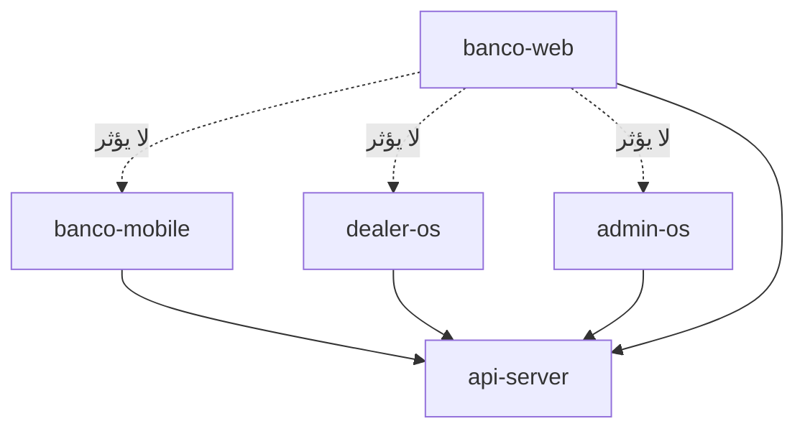

# BANCO — إنهاء تشغيل الأسطح (موبايل · ماركت · أدمن · API)

**التاريخ:** 2026-07-10  
**SHA مرجعي:** `0c4220d` · tag `v1.1.4-production-2026-07-10`  
**الحكم:** الكود **19/19** محلياً — التشغيل الحي يحتاج redeploy + أسرار

---

## 1) ما الذي يعمل الآن (لا تلمسه)

| السطح | الحالة المحلية | العزل |
|--------|----------------|-------|
| **api-server** | waves 6–10C مغلقة | Replit / AWS |
| **banco-mobile** | typecheck + 84 regression | EAS |
| **dealer-os** (Banco Market) | Vite static `/dealer-os/` | Replit artifact |
| **admin-os** | Vite static `/admin-os/` | Replit artifact |
| **banco-web** | build PASS (17 routes) | CDN منفصل — **الوكيل يكمله** |

---

## 2) API — الخطوة الأولى (أنت على Replit)

### أ) Redeploy سريع (نسخ ولصق)

```bash
bash audit/mobile/REPLIT-SHELL-COPYPASTE.sh
```

ثم في Replit UI: **Stop → Run** على workflow **api-server**.

### ب) على جهازك (انتظار FRESH)

```powershell
cd C:\Users\waelz\Downloads\BANCO-CA-OOM
pnpm run ops:redeploy-watch
pnpm run ops:post-redeploy
pnpm run ops:wave-b
```

**هدف النجاح:** `post-redeploy-verify` exit **0** — يتضمن `seller.social_links` على `GET /v1/listings/{id}` (wave 8).

### ج) Upload smoke (بعد FRESH)

```powershell
$env:CLERK_BEARER_TOKEN = "<token-from-clerk-test-user>"
node audit/mobile/scripts/verify-upload-claims-schema.mjs
```

---

## 3) Banco Market (dealer-os)

| البند | القيمة |
|-------|--------|
| **المسار على Replit** | `/dealer-os/` |
| **Artifact** | `artifacts/dealer-os/.replit-artifact/artifact.toml` |
| **Build** | `pnpm --filter @workspace/dealer-os run build` |
| **Output** | `artifacts/dealer-os/dist/public` |

### تشغيل محلي

```bash
pnpm --filter @workspace/dealer-os run dev
# BASE_PATH=/dealer-os/ PORT=21539
```

### على Replit

1. تأكد أن artifact **BANCO Market** مفعّل في الـ deployment.
2. بعد pull على `main` → Replit يبني تلقائياً أو Run workflow الخاص بالـ static web.
3. افتح: `https://<replit-host>/dealer-os/`

### تحقق سريع

- [ ] الصفحة الرئيسية تحمّل بدون 404 على assets
- [ ] تسجيل الدخول Clerk (نفس `CLERK_PUBLISHABLE_KEY` للبيئة)
- [ ] إنشاء/تعديل listing يظهر في API → الموبايل

---

## 4) Admin Control (admin-os)

| البند | القيمة |
|-------|--------|
| **المسار** | `/admin-os/` |
| **Artifact** | `artifacts/admin-os/.replit-artifact/artifact.toml` |
| **Build** | `pnpm --filter @workspace/admin-os run build` |

### على Replit

نفس خطوات dealer-os — artifact منفصل **BANCO Admin Control Center**.

### تحقق سريع

- [ ] `/admin-os/` يحمّل
- [ ] صلاحيات admin (Clerk role / allowlist حسب إعدادكم)
- [ ] moderation / listings panels تتصل بـ API

**ملاحظة (محدّث 2026-07-18):** kill-switch **وقت التشغيل** للموقع مُنفَّذ عبر `WEB_PLUG_ENABLED` على `banco-web` (Phase 6) — انظر `audit/website/WEBSITE-PLUG-DETACH-5MIN-AR.md`. تحكم الأدمن عبر API (`consumer_web_enabled`) ما زال مستقبلياً.

---

## 5) Mobile (banco-mobile) — EAS

### ترتيب صحيح

1. API live **FRESH** (§2)
2. Device QA على **preview** APK/IPA
3. ثم **production** build + store submit

```bash
cd artifacts/banco-mobile
eas build --profile preview --platform android
# بعد QA:
eas build --profile production --platform all
eas submit --profile production --platform all
```

**مراجع:**

- `audit/mobile/MOBILE-PUBLISH-SUCCESS-GATE.md`
- `audit/mobile/DEVICE-QA-SECTION-COMPANIES.md`
- `release/EAS_BUILD.md`

### Env مطلوب في EAS

- `EXPO_PUBLIC_API_URL` → نفس host الـ API الحي
- Clerk keys للبيئة (production vs preview)

---

## 6) AWS (إنتاج بديل لـ Replit)

```bash
node scripts/generate-aws-virgen-sync-manifest.mjs --tag v1.1.4-production-2026-07-10
./scripts/publish-aws-virgen-rc.sh v1.1.4-production-2026-07-10
# GitHub Actions: deploy.yml على tag
```

**متطلب:** `AWS_VIRGEN_SYNC_TOKEN` + secrets في GitHub.

---

## 7) banco-web (الوكيل — منفصل تماماً)

**لا يمنع** الموبايل/ماركت/أدمن إذا سقط.

### Flags آمنة (افتراضي)

```env
NEXT_PUBLIC_SEARCH_ENABLED=true
NEXT_PUBLIC_WEB_SEARCH_LIVE=false
NEXT_PUBLIC_WEB_SEARCH_MAP=false
NEXT_PUBLIC_WEB_MARKET_COPY=false
WEB_PLUG_ENABLED=true
NEXT_PUBLIC_API_BASE_URL=https://banco-ca-oom.replit.app
```

**Kill-switch (فصل الويب ≤5 دقائق):** `WEB_PLUG_ENABLED=false` ثم إعادة تشغيل `consumer-web` فقط.  
تفاصيل: [`audit/website/WEBSITE-PLUG-DETACH-5MIN-AR.md`](../audit/website/WEBSITE-PLUG-DETACH-5MIN-AR.md).  
Soft-launch: [`audit/website/WEBSITE-SOFT-LAUNCH-CHECKLIST-AR.md`](../audit/website/WEBSITE-SOFT-LAUNCH-CHECKLIST-AR.md).  
مراقبة: `/api/health` أو `/api/healthz` (نفس الـ JSON).

### تحقق قبل نشر CDN

```bash
node scripts/verify-website-boundaries.mjs
pnpm run typecheck:website
pnpm run lint:website
pnpm --filter @workspace/banco-web run build
node scripts/website-seo-static-audit.mjs
node scripts/website-bundle-budget.mjs
node scripts/website-plug-hardening-audit.mjs
```

### Docker (اختياري)

```bash
docker build -f deploy/aws/Dockerfile.banco-web -t banco-web:local .
# أو compose:
# docker compose -f deploy/aws/docker-compose.banco-web.yml up -d
```

---

## 8) مصفوفة «من يعتمد على من»



---

## 9) checklist «جاهز للرفع والتجربة»

**الأولوية:** صفوف 1–6 (موبايل/API) قبل أي soft-launch للويب.

| # | المهمة | المسؤول | الحالة |
|---|--------|---------|--------|
| 1 | Replit redeploy api-server | أنت | ⏳ |
| 2 | `ops:redeploy-watch` → FRESH | أنت | ⏳ |
| 3 | `CLERK_BEARER_TOKEN` upload smoke | أنت | ⏳ |
| 4 | dealer-os + admin-os artifacts على Replit | أنت | ⏳ |
| 5 | EAS preview + device QA | أنت | ⏳ |
| 6 | aws-virgen sync (إن AWS prod) | أنت | ⏳ |
| 7 | banco-web: `pnpm run ops:website-ci` | الوكيل | ✅ محلي |
| 8 | banco-web CDN staging | الوكيل/أنت | ⏳ |

---

**مراجع:** [`PRODUCTION-FULL-SNAPSHOT-2026-07-10.md`](./PRODUCTION-FULL-SNAPSHOT-2026-07-10.md) · [`audit/website/WEBSITE-EXECUTION-PRIORITY-AR.md`](../audit/website/WEBSITE-EXECUTION-PRIORITY-AR.md) · [`audit/mobile/NEXT-OPS-REPLIT-REDEPLOY.md`](../audit/mobile/NEXT-OPS-REPLIT-REDEPLOY.md)
